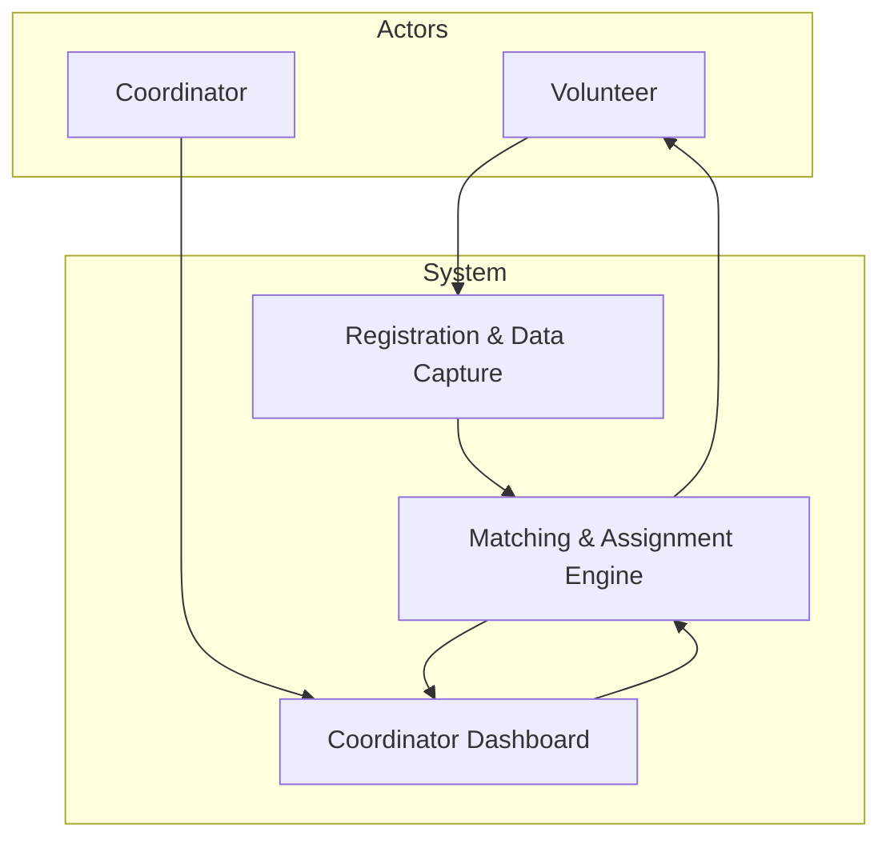

name: volunteer-matching-hitl-prototype  
overview: Phased implementation plan for a Next.js + Tailwind + Prisma (SQLite) prototype of a 3‑tier human‑in‑the‑loop volunteer matching system with volunteer/coordinator views and capacity‑aware matching.  
todos:

- id: phase-0-stack-check  
content: Verify stack, Prisma setup, and decide on routing and component conventions for volunteer/coordinator views.  
status: pending
- id: phase-1-domain-modeling  
content: Design and migrate Prisma schema for Volunteer, Availability, Task, Assignment, and EventLog with enums for skills and statuses.  
status: pending
- id: phase-4-volunteer-flows  
content: Implement volunteer registration, dashboard with mission proposals, and accept/decline flow with capacity updates.  
status: pending
- id: phase-5-6-coordinator-matching  
content: Build coordinator dashboard, task management, and all three matching modes (manual, semi-automatic, automatic) with capacity and constraint checks.  
status: pending
- id: phase-8-9-ux-eval  
content: Refine UX, add explanations and event logging, and prepare demo scenarios and tests for thesis evaluation.  
status: pending  
isProject: false

---

## Master Development Plan (`plan.md`)

This checklist assumes an existing Next.js + Tailwind CSS + Prisma (SQLite) project scaffolded but not yet functionally implemented.

### Phase 0 – Project sanity check & groundwork

- **Confirm stack & tooling**
  - Open the project README at `[README.md](README.md)` and verify assumptions: Next.js (app router), Tailwind CSS, Prisma with PostgreSQL (current datasource).
  - Run the dev server (`npm run dev` or `yarn dev`) and confirm the starter page renders without errors.
  - Run `prisma generate` and ensure Prisma client is generated successfully.
  - Run `prisma migrate status` (or check migrations folder) to confirm the database is in a clean state.
- **Set up basic project conventions**
  - Decide folder layout for views: e.g. `[app/(volunteer)](app/(volunteer))` and `[app/(coordinator)](app/(coordinator))` group routes.
  - Decide on UI component structure, e.g. common components under `[app/components](app/components)`.
  - Define a simple global view-mode toggle (Volunteer vs Coordinator) strategy (e.g. React context + header switcher, or URL segment like `/volunteer` and `/coordinator`).

### Phase 1 – Core domain modeling (Prisma schema)

- **Review existing schema**
  - Open `[prisma/schema.prisma](prisma/schema.prisma)` and identify any existing models (`Volunteer`, `Task`, `Assignment`) and the current PostgreSQL datasource.
  - Decide which models to keep vs refactor for this prototype (keep all three as core).
- **Define enums and value lists**
  - Add a `Skill` enum (e.g., `HEAVY_PHYSICAL`, `MEDIUM_PHYSICAL`, `LIGHT_PHYSICAL`, `MEDICAL`, `TRANSLATION`, `CHILDCARE`, `ADMINISTRATION`, `INFORMATION_RETRIEVAL`, `OTHER`) based on IR-03.
  - Add an `AssignmentStatus` enum (`PROPOSED`, `ACCEPTED`, `DECLINED`, `CANCELLED`, `COMPLETED`) to capture volunteer co-determination states.
  - Add a `TaskStatus` enum (`OPEN`, `PARTIALLY_FILLED`, `FULL`, `INACTIVE`) to support FR-30 + NFR-01.
  - Add an `AutomationMode` enum (`MANUAL`, `SEMI_AUTO`, `AUTO`) to tag how assignments were generated (FR-09).
  - Add a `Priority` enum (`LOW`, `MEDIUM`, `HIGH`, `CRITICAL`) for task urgency (IR-10).
- **Model volunteers**
  - Extend the `Volunteer` model to include: `postalCode` (optional), `location` (optional), `skills` as `Skill[]` (instead of `String[]`), `availabilityBlocks` relation, `updatedAt` field, while keeping existing `id`, `name`, `email`, and `createdAt`.
  - Remove the opaque `availability Json` field in favor of structured availability (see `Availability` model).
- **Model availability**
  - Define an `Availability` model with: `id`, `volunteerId`, `start`, `end`, optional `note`, `createdAt`, and `updatedAt`.
  - Link `Availability` entries to `Volunteer` via a foreign key (`volunteerId`) and a back-relation `availabilityBlocks` on `Volunteer`.
- **Model tasks**
  - Extend the `Task` model to include: `title`, optional `postalCode`, `meetingPoint`, `screeningRequired`, `screeningNote`, `updatedAt`.
  - Change `requiredSkills` to `Skill[]` and keep `category`, `description`, `location`, `capacity`, `startTime`, `endTime`.
  - Replace `priority: String` with `priority: Priority @default(MEDIUM)`.
  - Replace `status: String` with `status: TaskStatus @default(OPEN)`.
  - Replace `automationMode: String` with `automationMode: AutomationMode @default(MANUAL)`.
- **Model assignments**
  - Extend the `Assignment` model to use `status: AssignmentStatus @default(PROPOSED)` instead of a raw `String`.
  - Add optional `automationMode: AutomationMode?` to record whether the assignment came from manual, semi-auto, or auto mode.
  - Add an optional `explanation: String?` to store a human-readable reason for the match (NFR-10).
  - Add `updatedAt: DateTime @updatedAt`.
  - Keep the uniqueness constraint on `(volunteerId, taskId)` to prevent duplicate assignments.
- **Model audit events (optional but recommended)**
  - Create an `EventLog` model capturing `id`, `timestamp`, `actorType` (`COORDINATOR` / `VOLUNTEER` / `SYSTEM` as `String`), `actorId` (optional), `eventType` (e.g., `VOLUNTEER_REGISTERED`, `TASK_CREATED`, `ASSIGNMENT_PROPOSED`, `ASSIGNMENT_ACCEPTED`), and `payload` JSON.
  - Plan to write to `EventLog` in later phases when registration, matching, and acceptance flows are implemented.
- **Run migrations (PostgreSQL)**
  - Keep the existing PostgreSQL `datasource db` configuration.
  - Create a new Prisma migration for the updated schema (e.g., `phase1_domain_model`).
  - Apply migrations to the PostgreSQL database.
  - Re-generate the Prisma client and confirm there are no type errors in the app.

### Phase 2 – Seed data & matching utilities (backend-only)

- **Create seed script**
  - Add a Prisma seed script under `[prisma/seed.ts](prisma/seed.ts)` (or similar) to insert sample volunteers, availability, and tasks.
  - Update seed data scenarios to reflect the thesis examples: Task 1 (Manual) = Pro Bono Lawyer; Task 2 (Semi-Auto) = Translator; Task 3 (Auto) = Handing out food.
  - Populate volunteers with diverse skills, postal codes, and availability windows.
  - Populate tasks with varying `maxCapacity`, `requiredSkills`, `priority`, and time slots.
  - Mark some tasks as nearly full to test automated shift capping (FR-28, FR-30).
- **Implement core matching utilities (pure functions)**
  - Create a utility module, e.g. `[lib/matching.ts](lib/matching.ts)`, for scoring volunteers against a task.
  - Implement a skill match score (e.g., count or weighted overlap between `Volunteer.skills` and `Task.requiredSkills`).
  - Implement a location proximity score (exact postal code match as highest score; optional simple string distance for nearby matches).
  - Implement an availability check (volunteer must have at least one availability block overlapping task `start`/`end`).
  - Implement a capacity check that rejects volunteers when `currentConfirmedAssignmentsForTask >= maxCapacity`.
  - Implement a composite score function that combines skill, location, and availability into a single ranking metric.
  - Add helper to sort a list of candidates and return top `N` matches for a task.
- **Unit-test matching utilities (optional but ideal)**
  - Add a minimal test harness (e.g., Vitest/Jest) if not already set up.
  - Write tests for skill scoring, location scoring, availability filtering, and capacity capping.

### Phase 3 – Global view-mode toggle (no real auth)

- **Implement view-mode state**
  - Create a `ViewModeContext` (or similar) under `[app/context/ViewModeContext.tsx](app/context/ViewModeContext.tsx)` to store `viewMode: 'VOLUNTEER' | 'COORDINATOR'`.
  - Provide this context at the root layout in `[app/layout.tsx](app/layout.tsx)`.
- **Create UI control for mode switching**
  - Implement a header component (e.g. `[app/components/AppHeader.tsx](app/components/AppHeader.tsx)`) with a simple toggle/dropdown to switch between `Volunteer` and `Coordinator` modes.
  - Ensure the active mode is visually clear (e.g., pill-style toggle, subtle color change).
  - Ensure the toggle only changes client-side state (no auth, no sessions).
- **Wire mode to navigation**
  - When `viewMode === 'VOLUNTEER'`, prominently link to the volunteer registration and dashboard routes.
  - When `viewMode === 'COORDINATOR'`, prominently link to the coordinator dashboard and task creation routes.

### Phase 4 – Volunteer-side flows (registration & dashboard)

- **Volunteer registration UI** (FR-01, FR-03, FR-04, IR-01, IR-02, IR-04)
  - Create a volunteer registration route, e.g. `[app/volunteer/register/page.tsx](app/volunteer/register/page.tsx)`.
  - Implement a form collecting minimal required data: `name`, `email`, `postalCode`, multi-select `skills` (from `Skill` enum), basic availability inputs (e.g., one or more date/time blocks), and optional preferences.
  - Add client-side validation (required fields, email format, simple postal code checks).
  - On submit, call an API route (e.g. `[app/api/volunteers/route.ts](app/api/volunteers/route.ts)`) to create the volunteer and associated availability in the database.
  - After successful submission, display a clear acknowledgement/thank-you message (FR-21) and brief explanation of what will happen next.
- **Coordinator-assisted registration (simplified)** (FR-05 – Should)
  - Add a quick-create volunteer form within the coordinator dashboard (Phase 5) for cases where a coordinator manually registers a volunteer.
- **Volunteer dashboard skeleton**
  - Create a volunteer dashboard route, e.g. `[app/volunteer/dashboard/page.tsx](app/volunteer/dashboard/page.tsx)`.
  - Design a compact, focused UI that lists the volunteer’s current assignments grouped by status (`PROPOSED`, `ACCEPTED`, `COMPLETED`, etc.).
  - For each `PROPOSED` assignment, include an obvious `Accept` and `Decline` button (FR-11, FR-19, FR-20, IR-07).
  - Limit visible information to mission-critical details (task title, time, location, contact info, key instructions) to respect NFR-12.
- **Volunteer-side action endpoints**
  - Implement an API route to fetch assignments for a given volunteer (for prototype, accept volunteer id from query or simple local state).
  - Implement an API route to update an assignment status when the volunteer clicks `Accept` or `Decline`.
  - Ensure that when a volunteer accepts an assignment, capacity counters update and related views (coordinator dashboard, other volunteers’ available tasks) reflect the change.
  - Optionally record these actions in `EventLog`.
- **Volunteer task discovery / filtering engine** (FR-31 – Must)
  - Add a section or separate route where volunteers can browse currently open `Task`s.
  - Implement filters for postal code, required skill, and optional priority category.
  - Ensure tasks that are `FULL` or `INACTIVE` are hidden or clearly marked as unavailable to prevent false expectations (FR-30, NFR-01).
  - For this prototype, decide whether volunteers can “self-apply” for tasks, or only see tasks for transparency; keep workflows consistent with thesis focus.

### Phase 5 – Coordinator dashboard UI & task management

- **Coordinator dashboard overview (glanceable UI)** (FR-02, FR-06, FR-07, FR-27, NFR-01)
  - Create a coordinator dashboard route, e.g. `[app/coordinator/dashboard/page.tsx](app/coordinator/dashboard/page.tsx)`.
  - Implement a task list table or card grid showing for each task: title, location, time window, status, priority, and capacity usage (e.g., progress bar `currentConfirmed / maxCapacity`).
  - Visually highlight urgent tasks (e.g., `CRITICAL` priority or severe shortages) via subtle but clear styling.
  - Automatically gray out or visually de-emphasize `FULL` tasks; optionally hide them behind a toggle to reduce cognitive load (FR-30).
- **Task creation & editing** (FR-06, FR-07, IR-08, IR-09)
  - Implement a `Create Task` form on a dedicated route, e.g. `[app/coordinator/tasks/new/page.tsx](app/coordinator/tasks/new/page.tsx)`.
  - Capture: title, category, description, location + postal code, required skills, start/end, `maxCapacity`, priority, screening flags, and optional meeting point.
  - **Explicit Automation Selection:** Make it highly visible and intuitive for the coordinator to choose the Automation Mode (Manual, Semi-Auto, Auto) during task creation. The UI must clearly map these modes to their respective workflows so the coordinator understands the degree of control they are delegating.
  - Implement API routes for `POST /api/tasks` and `PATCH /api/tasks/:id` to handle creation and updates via Prisma.
  - Add a `View/Edit` task detail page (e.g. `[app/coordinator/tasks/[id]/page.tsx](app/coordinator/tasks/[id]/page.tsx)`) that shows assignments, match suggestions, and the three automation controls.
- **Coordinator volunteer search/filter** (FR-27 – Could)
  - Within the task detail view, add a panel that allows coordinators to filter volunteers by skills, postal code, and basic availability.
  - Implement the backend query (Prisma) to fetch volunteers matching filter criteria (without auto-assigning).

### Phase 6 – 3-Tier matching engine implementation

- **Shared application flow**
  - Volunteer browsing tasks clicks "Apply". This creates an `Assignment` with status `PROPOSED`.
  - Implement a function that, given a `taskId`, loads the task, current confirmed assignments, and applicant volunteers (those with a `PROPOSED` assignment) that are not double-booked and within availability (FR-13, FR-14).
  - Wire this function into API routes for manual, semi-automatic, and automatic matching.
- **Mode 1 – Manual coordination** (FR-09, FR-12)
  - In the task detail view, display a list of applicant volunteers (who applied and are in `PROPOSED` status).
  - Coordinator reaches out to the volunteer offline to discuss the mission. Status remains `PROPOSED` during this process.
  - Once discussions conclude, coordinator uses an `Accept` or `Decline` button per volunteer applicant that calls an API to update their `Assignment` status to `ACCEPTED` or `DECLINED`.
  - Enforce capability constraints: only allow assignments when a volunteer's skills satisfy `Task.requiredSkills` (FR-12).
  - Enforce capacity and no double-booking: block new assignments when max capacity is reached or a volunteer is already assigned at overlapping times (FR-14, FR-28).
- **Mode 2 – Semi-automatic approval (Human-in-the-Loop)** (FR-09, FR-10)
  - Add a `Get Suggestions` (or `Score Applicants`) button on the task detail page.
  - When clicked, call an API (e.g. `POST /api/tasks/[id]/suggestions`) that uses the matching utilities to compute a ranked shortlist of the best *applicants* (from those currently `PROPOSED`) for this task.
  - Return volunteers with their match score breakdown (skill match, location match, availability) and a short explanation string saved in the `Assignment` `explanation` field (NFR-10).
  - Display the ranked suggestions in the UI. Since the system provides high-confidence matches, the coordinator can directly click `Accept` or `Decline` without necessarily contacting them first.
  - On approval, update assignment status to `ACCEPTED` and enforce capacity and double-booking rules.
- **Mode 3 – Automatic auto-accept** (FR-09, FR-28, FR-30, FR-16, FR-17)
  - **Supervisory Control for Auto-Mode:** To justify Auto Mode as Human-in-the-Loop (HITL), it cannot be a complete black box. The coordinator must manually trigger the Auto-Fill action. Once executed, the system must present a "Post-Action Review" or "Summary Log" (e.g., "System assigned 15 volunteers to reach capacity. Click to review roster") so the human remains the ultimate overseer.
  - The system listens for incoming volunteer applications (creation of `PROPOSED` assignment).
  - It instantly evaluates the application against skills, location, availability, and remaining task capacity.
  - If the application satisfies all constraints and the task is not full, it automatically updates the assignment to `ACCEPTED`.
  - Ensure that once capacity is reached, task `status` is set to `FULL` and the task is hidden/greyed out in volunteer-facing views (FR-28, FR-30).
  - (Optional) implement balancing logic to avoid overfilling some tasks while others lack volunteers (FR-16, FR-17).

### Phase 7 – Volunteer co-determination and status flow (FR-11)

- **Application delivery and status updates**
  - Decide how volunteers "log in" for the prototype (e.g., choose a volunteer from a list or temporary URL with query parameter; no real auth).
  - Volunteers browse tasks and click "Apply".
  - They see their applications in their dashboard. The status shows as "Pending Coordinator Review" (if `PROPOSED`), "Accepted", or "Declined".
  - When an application is updated to `ACCEPTED` (manually, semi-auto, or auto), increment the confirmed count for the task and re-evaluate whether `Task.status` should change to `PARTIALLY_FILLED` or `FULL`.
- **Consistency & edge cases**
  - Handle the edge case where a volunteer tries to accept a proposal for a now-full or time-conflicting task: show a simple error message and mark the proposal as `CANCELLED` or `DECLINED`.
  - Ensure volunteers cannot accept overlapping tasks beyond acceptable limits (enforce FR-14).
  - Optionally integrate simple workload capping per volunteer (FR-15) by limiting total accepted hours within a time horizon.

### Phase 8 – Non-functional requirements & UX refinement

- **Usability under pressure (NFR-01, NFR-08, NFR-12, NFR-15)**
  - **Cognitive Load Reduction (HCI):** Refactor UI components based on Cognitive Load Theory. Emphasize "chunking" of information, reduce visual clutter, and establish a clear visual hierarchy to reduce the coordinator's mental burden.
  - **Mitigating Decision Fatigue:** For manual review queues (Modes 1 and 2), implement pagination or small batch processing instead of infinite scroll to prevent coordinator fatigue.
  - Iterate on the coordinator dashboard layout to maximize at-a-glance comprehension (clear labels, grouping, and consistent color coding for states).
  - Ensure all primary actions (Create Task, Get Suggestions, Auto-Fill, Assign) are visually prominent but not overwhelming.
  - Make sure both volunteer and coordinator UIs are responsive and usable on laptops and tablets.
  - Minimize on-screen clutter; hide rarely used controls behind simple disclosures.
- **Explainability (NFR-10)**
  - In the coordinator dashboard, show a brief explanation (e.g., `Matched because: heavy physical work + same postal code + available 10–12`) alongside each suggested volunteer.
  - Store these explanations in `Assignment.explanation` for potential later analysis.
- **Auditability & reporting (NFR-04, NFR-05, IR-14)**
  - Ensure key events (volunteer registration, task creation, assignment proposals, accept/decline actions, auto-fill runs) write to `EventLog`.
  - Add a simple coordinator-accessible event history view (even a raw table) filtered by task or volunteer.
  - Optionally add a basic report view summarizing total volunteers per task and hours (approx.) for thesis screenshots.

### Phase 9 – Demo data, testing, and thesis evaluation support

- **Demo scenario preparation**
  - Seed or manually create a realistic scenario: multiple tasks with different locations, capacities, and priorities; diverse volunteers with overlapping skills and availability.
  - Verify that auto-fill and suggestion modes behave sensibly in this scenario (e.g., no over-assignments, clear capacity visualization).
  - Capture screenshots or screen recordings of key flows for thesis documentation.
- **End-to-end walkthrough tests**
  - Walk through the full volunteer journey: registration → wait → receive mission proposals → accept/decline → see updated dashboard.
  - Walk through the full coordinator journey: create tasks → monitor capacities → try manual assignments → use `Get Suggestions` → use `Auto-Fill`.
  - Verify that all capacity constraints, availability checks, and double-booking protections behave as expected.
  - Confirm that UI states (e.g., task status, progress bars, lists of open opportunities) update immediately after actions.
- **Performance & UX sanity checks**
  - Populate the database with a larger number of volunteers and tasks to gauge performance and UX under load (NFR-02, NFR-03).
  - Optimize any obviously slow Prisma queries (e.g., add basic indexes in Prisma schema where needed).

### Phase 10 – Documentation & future work notes

- **Developer documentation**
  - Update `[README.md](README.md)` with instructions for running the app, seeding data, and a short architecture overview (Registration, Matching, Dashboard).
  - Document how the 3 automation modes are implemented, including any trade-offs and simplifications versus the literature.
  - Document the data model (key Prisma models and enums) with a short explanation for each.
- **Thesis alignment notes**
  - Map each implemented feature back to the corresponding FR/IR/NFR IDs from `[requirements.md](requirements.md)` and note which are fully, partially, or not implemented.
  - Explicitly describe any simplifications (e.g., how availability is modelled, workload capping approximations, missing communication features) and justify them in terms of the thesis scope.
  - Capture open questions and potential extensions (e.g., real authentication, notifications, integration with municipal systems) as future work.

